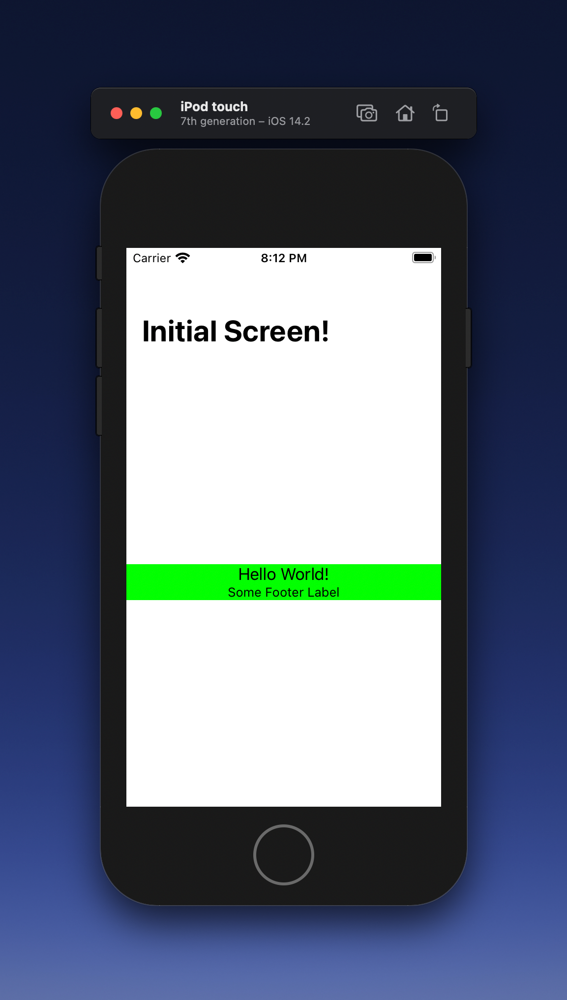
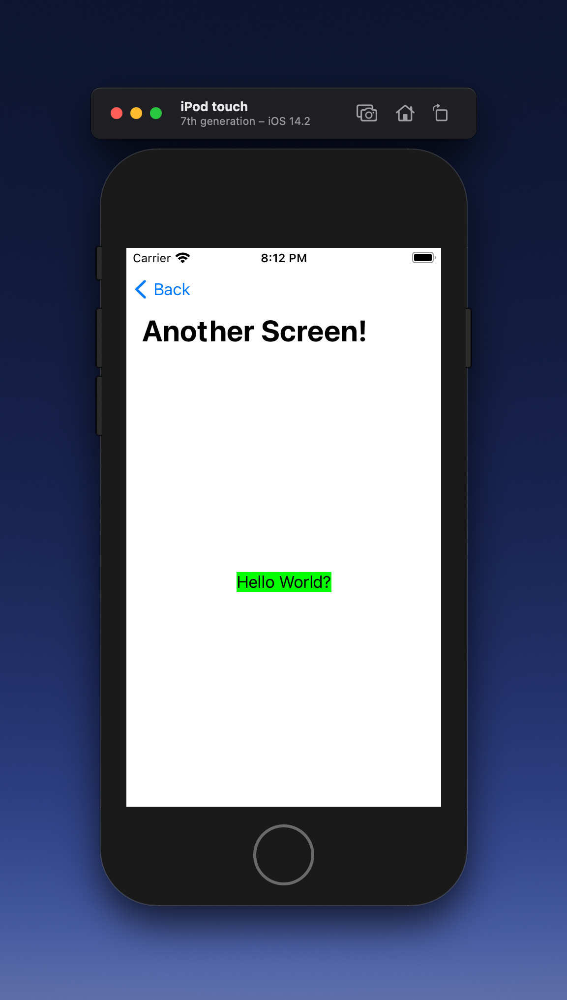

# EUI-POC
POC of EUI

## Example App

```swift
import EUI
import SwiftUI
import ScreenData

@main
struct EUI_POCApp: App {
    var body: some Scene {
        EUIAppScene(
            app: EUIApp(
                launchScreen: EUIScreen(
                    id: "launch",
                    title: "Launch Screen!",
                    backgroundColor: .green,
                    headerView: nil,
                    bodyView: .button(SomeButton(title: "Loading", actionID: "print"))
                ),
                initialScreen: EUIScreen(
                    id: "initial",
                    title: "Initial Screen!",
                    backgroundColor: .green,
                    headerView: nil,
                    bodyView: .button(SomeButton(title: "Hello World!", actionID: "print")),
                    footerView: .label(
                        SomeLabel(
                            title: "Some Footer Label",
                            font: .title,
                            destination: Destination(type: .screen, toID: "another")
                        )
                    )
                ),
                screens: [
                    EUIScreen(
                        id: "another",
                        title: "Another Screen!",
                        backgroundColor: .green,
                        bodyView: .button(SomeButton(title: "Hello World?"))
                    )
                ],
                actions: [
                    EUIAction(id: "print", action: .complete(.void { print("Hello, World!")}))
                ],
                fonts: EUIFonts(
                    largeTitle: nil,
                    title: .footnote,
                    headline: nil,
                    body: nil,
                    footnote: nil,
                    caption: nil
                )
            )
        )
    }
}
```

## Example Images

### Initial


### Another

